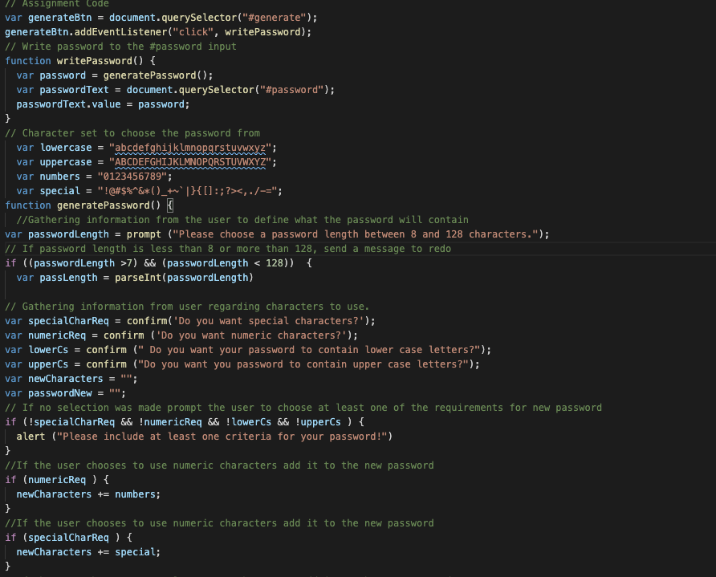
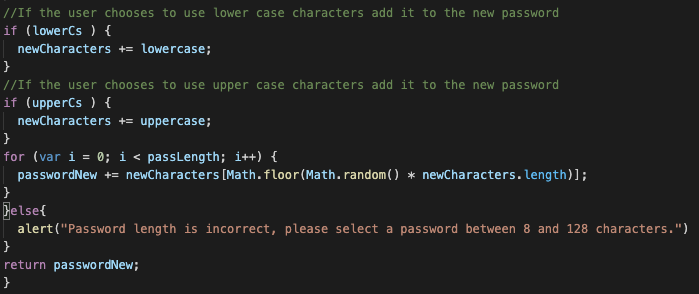

# GeneratePWD
Generate Random Password

* Task was to enable employee to generate a random password.
The options to choose from are numeric, upper case, lower case and special character, and at least one of the options is supposed to be selected.

* If non are selected when prompted, user gets an error message and is required to select at least one.

* Password length is supposed to be between 8 characters and 128.
If user selects a password that is less than 8 or more than 128, gets an error message prompting to choose required length.

* After each confirmation users input is generated and concatenated into the new password.

#Code screenshot : 
 
 

 #Link to deployed application :
 https://dilberovicka31.github.io/GeneratePWD/

